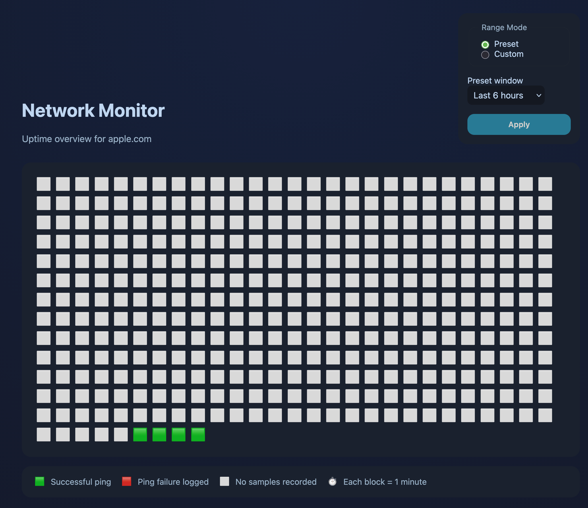

# Network Monitor

A small Node.js service that pings `apple.com` every minute, stores the results in SQLite forever, and serves a password-protected dashboard for visualizing uptime blocks.



## Features

- Background scheduler pings the configured host on a fixed cadence (default: every 60 seconds).
- All ping attempts (success or failure) persist in SQLite so historical windows can be rendered at different granularities.
- Express server secured with Basic Auth; the password comes from `STATUS_PAGE_PASSWORD` in `.env`.
- Web UI with presets (last 1/6/24 hours, 7 days) or arbitrary start/end range selection.
- Emoji-based timeline that automatically adjusts block duration (1 minute, 10 minutes, or 1 hour) and tooltips showing the exact interval.

## Getting Started

1. **Install dependencies**
   ```bash
   npm install
   ```
2. **Create environment file**
   ```bash
   cp .env.example .env
   # edit .env to set STATUS_PAGE_PASSWORD and any optional overrides
   ```
3. **Run the monitor**
   ```bash
   npm start
   ```

### Keep the service alive with PM2

Install dependencies and then run the helper script to launch/restart via PM2:

```bash
./scripts/run_with_pm2.sh
```

This uses the local `pm2` dependency (invoked through `npx`) so restarts happen automatically if the process crashes. View runtime info with `npx pm2 status network-monitor` and logs via `npx pm2 logs network-monitor`.

The app listens on `PORT` (default `3000`). Open the page in a browser, enter the password when prompted, and explore the timeline.

## Configuration

All configuration is done through environment variables (see `.env.example`). Useful overrides:

- `STATUS_PAGE_PASSWORD` – Required; visitors must enter this password.
- `PING_TARGET` – Hostname to ping. Defaults to `apple.com`.
- `PING_INTERVAL_MS` – Interval between probes in milliseconds. Defaults to 60000.
- `PING_TIMEOUT_SECONDS` – Ping timeout per request. Defaults to 10 seconds.
- `PORT` – HTTP server port. Defaults to 3000.
- `DATABASE_PATH` – Where the SQLite database lives. Defaults to `data/ping.sqlite`.

## Development

Use `npm run dev` to start the process with `nodemon` for auto-restart on changes.


## License

[GPL v3](https://www.gnu.org/licenses/gpl-3.0.en.html)
